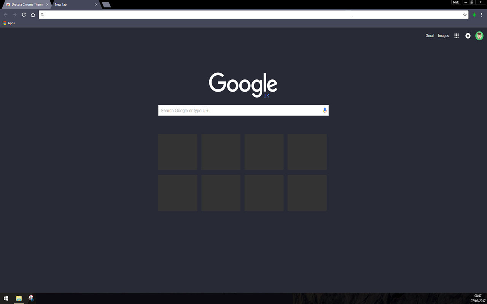

# Dracula for [Google Chrome](https://chrome.google.com/webstore/detail/dracula-chrome-theme/gfapcejdoghpoidkfodoiiffaaibpaem?utm_source=chrome-ntp-icon)

> A dark theme for [Google Chrome](https://chrome.google.com/webstore/detail/dracula-chrome-theme/gfapcejdoghpoidkfodoiiffaaibpaem?utm_source=chrome-ntp-icon).

## Install

All instructions can be found at [draculatheme.com/chrome](https://draculatheme.com/chrome).

If you wish to install it in your browser using the Google Chrome store, please follow [this link](https://chrome.google.com/webstore/detail/dracula-chrome-theme/gfapcejdoghpoidkfodoiiffaaibpaem?utm_source=chrome-ntp-icon) 

## Team

This theme is maintained by the following person(s) and a bunch of [awesome contributors](https://github.com/dracula/template/graphs/contributors).

 |
--- |
[Nick](https://github.com/nickimola)|

## License

[MIT License](./LICENSE)
